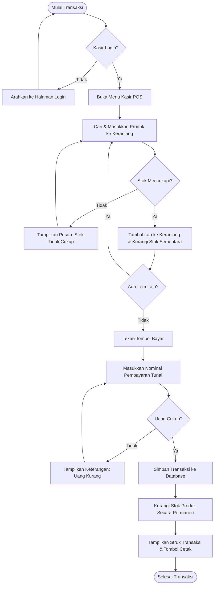
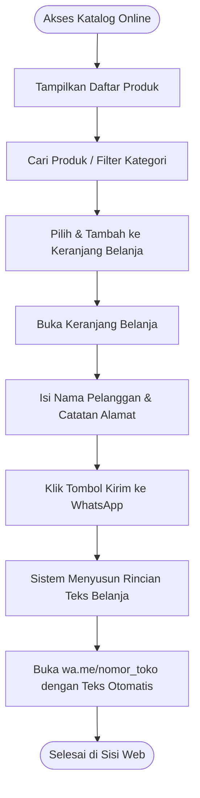

# Diagram Sistem & Alur Kerja - RitelKM

Dokumen ini memuat representasi visual dari sistem RitelKM menggunakan diagram **Mermaid**. Diagram ini mencakup interaksi aktor, aliran proses logika bisnis, serta arsitektur sistem.

---

## 1. Use Case Diagram

Diagram Use Case menunjukkan hubungan antara aktor utama (Owner, Kasir, dan Pelanggan) dengan fitur-fitur di dalam sistem RitelKM.

```mermaid
usecaseDiagram
    actor Owner
    actor Kasir
    actor Pelanggan

    rectangle RitelKM {
        usecase "UC-01: Login & Kelola Akun" as UC_Login
        usecase "UC-02: Mengelola Inventaris (Stok)" as UC_Stok
        usecase "UC-03: Memproses POS & Transaksi Kasir" as UC_POS
        usecase "UC-04: Memantau Dasbor Penjualan" as UC_Report
        usecase "UC-05: Menjelajahi Katalog Online" as UC_Catalog
        usecase "UC-06: Mengirim Keranjang Belanja ke WhatsApp" as UC_Order
    }

    Owner --> UC_Login
    Owner --> UC_Stok
    Owner --> UC_POS
    Owner --> UC_Report

    Kasir --> UC_Login
    Kasir --> UC_POS

    Pelanggan --> UC_Catalog
    Pelanggan --> UC_Order
```

---

## 2. Flowchart Aliran Transaksi Kasir (POS)

Flowchart di bawah menggambarkan langkah-langkah yang dilalui oleh **Kasir** saat merekam transaksi penjualan di toko fisik, termasuk proses validasi kecukupan stok barang.



---

## 3. Flowchart Pemesanan via Katalog Online (Pelanggan)

Flowchart ini menggambarkan langkah pelanggan dari menjelajahi katalog digital hingga mengirim detail pesanan belanja ke nomor WhatsApp admin toko.



---

## 4. Diagram Arsitektur C4 (Container Level)

Diagram Container ini menggambarkan arsitektur perangkat lunak dari aplikasi RitelKM yang menggunakan pola arsitektur **Laravel + Inertia.js + React**.

```mermaid
graph TB
    subgraph Pengguna
        OwnerActor[Owner/Admin]
        KasirActor[Kasir]
        CustomerActor[Pelanggan]
    end

    subgraph RitelKM System [Sistem Aplikasi RitelKM]
        subgraph Browser [Aplikasi Frontend]
            ReactApp["Single Page Application (React SPA)<br>UI Pages & POS Components"]
        end

        subgraph Server [Aplikasi Backend - Laravel]
            Inertia["Inertia.js Protocol<br>(State & Routing Bridge)"]
            LaravelCore["Laravel Framework Core<br>(Controllers, Middleware, Eloquent ORM)"]
            Pint["Standard Code Formatter<br>(Laravel Pint)"]
        end

        subgraph DatabaseEngine [Penyimpanan]
            DB[("Database SQL<br>(SQLite / MySQL)")]
        end
    end

    subgraph Layanan Eksternal
        WhatsAppAPI["Layanan WhatsApp Web / App<br>(wa.me Link integration)"]
    end

    %% Hubungan interaksi pengguna
    OwnerActor -->|Mengakses Dashboard| ReactApp
    KasirActor -->|Mengakses Antarmuka Kasir| ReactApp
    CustomerActor -->|Mengakses Katalog Online| ReactApp

    %% Hubungan frontend - backend (Inertia)
    ReactApp -->|HTTP/JSON Requests via Inertia| Inertia
    Inertia -->|Melewatkan Data & Rute| LaravelCore
    LaravelCore -->|Mengembalikan State Props (JSON)| Inertia
    Inertia -->|Update UI React| ReactApp

    %% Hubungan backend ke database
    LaravelCore -->|Query SQL (Eloquent)| DB
    
    %% Hubungan ke layanan eksternal
    ReactApp -->|Membuka Tautan WhatsApp| WhatsAppAPI
```
