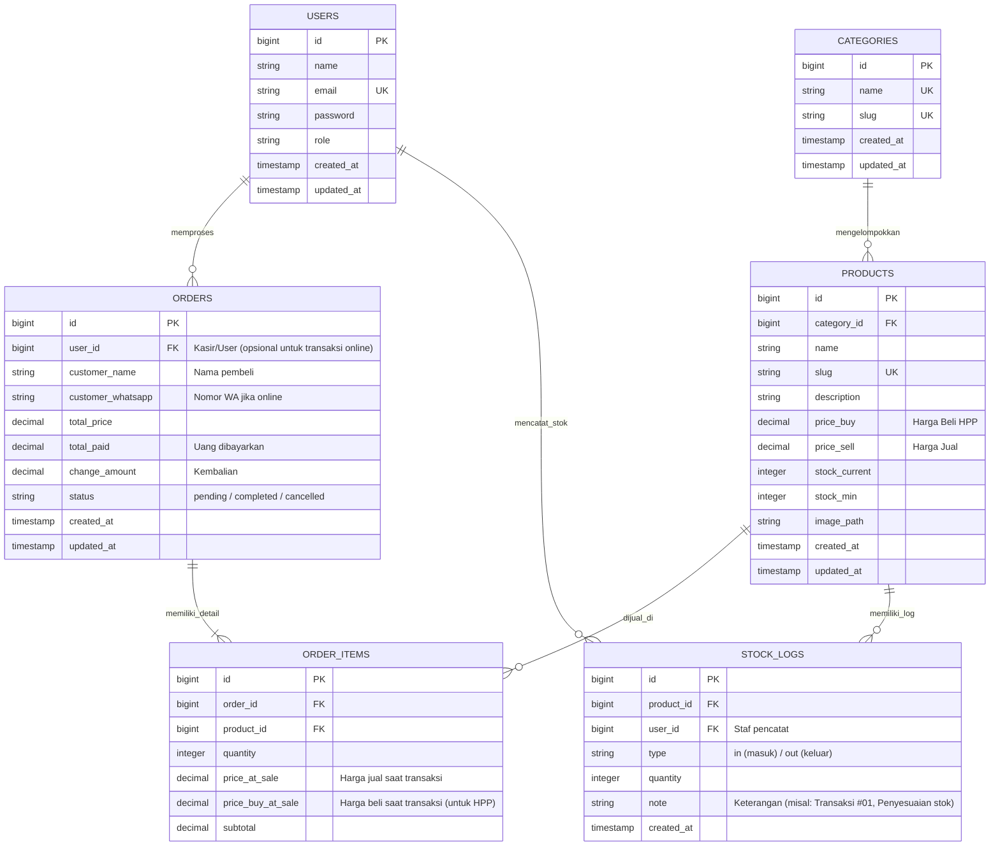

# Desain Database & ERD - RitelKM

Dokumen ini merancang struktur penyimpanan data untuk sistem RitelKM. Database menggunakan model relasional yang cocok diimplementasikan menggunakan MySQL, PostgreSQL, maupun SQLite.

---

## 1. Entity Relationship Diagram (ERD)

Diagram berikut digambarkan menggunakan sintaks Mermaid ERD untuk memperlihatkan hubungan antar entitas data dalam RitelKM.

---

## 2. Spesifikasi Skema Tabel

### 2.1 Tabel `users`
Menyimpan data akun pengguna (Owner/Kasir) untuk autentikasi sistem.

| Kolom | Tipe Data | Nullable | Default | Keterangan |
| :--- | :--- | :--- | :--- | :--- |
| `id` | Bigint (unsigned) | No | Auto Increment | Primary Key |
| `name` | Varchar(255) | No | - | Nama lengkap staf/pemilik |
| `email` | Varchar(255) | No | - | Email unik untuk login |
| `password` | Varchar(255) | No | - | Hash Bcrypt password |
| `role` | Enum('owner', 'kasir') | No | 'kasir' | Hak akses sistem |
| `created_at` | Timestamp | Yes | NULL | Tanggal akun dibuat |
| `updated_at` | Timestamp | Yes | NULL | Tanggal akun diperbarui |

### 2.2 Tabel `categories`
Menyimpan pengelompokan kategori produk untuk mempermudah navigasi katalog.

| Kolom | Tipe Data | Nullable | Default | Keterangan |
| :--- | :--- | :--- | :--- | :--- |
| `id` | Bigint (unsigned) | No | Auto Increment | Primary Key |
| `name` | Varchar(100) | No | - | Nama Kategori (e.g. 'Minuman') |
| `slug` | Varchar(120) | No | - | Slug URL unik |
| `created_at` | Timestamp | Yes | NULL | Tanggal dibuat |
| `updated_at` | Timestamp | Yes | NULL | Tanggal diperbarui |

### 2.3 Tabel `products`
Menyimpan detail informasi produk yang dijual.

| Kolom | Tipe Data | Nullable | Default | Keterangan |
| :--- | :--- | :--- | :--- | :--- |
| `id` | Bigint (unsigned) | No | Auto Increment | Primary Key |
| `category_id` | Bigint (unsigned) | No | - | Foreign Key ke `categories(id)` |
| `name` | Varchar(255) | No | - | Nama produk (e.g. 'Kopi Gayo') |
| `slug` | Varchar(255) | No | - | Slug URL unik |
| `description` | Text | Yes | NULL | Deskripsi detail produk |
| `price_buy` | Decimal(12,2) | No | 0.00 | Harga modal beli (HPP) |
| `price_sell` | Decimal(12,2) | No | 0.00 | Harga jual ke pelanggan |
| `stock_current` | Integer | No | 0 | Stok barang saat ini |
| `stock_min` | Integer | No | 0 | Batas stok minimum peringatan |
| `image_path` | Varchar(255) | Yes | NULL | File path foto produk |
| `created_at` | Timestamp | Yes | NULL | Tanggal produk ditambahkan |
| `updated_at` | Timestamp | Yes | NULL | Tanggal produk diperbarui |

### 2.4 Tabel `orders`
Menyimpan data kepala (header) transaksi penjualan baik POS maupun pesanan online.

| Kolom | Tipe Data | Nullable | Default | Keterangan |
| :--- | :--- | :--- | :--- | :--- |
| `id` | Bigint (unsigned) | No | Auto Increment | Primary Key |
| `user_id` | Bigint (unsigned) | Yes | NULL | Foreign Key ke `users(id)` (kasir) |
| `customer_name` | Varchar(150) | No | 'Pelanggan Toko'| Nama pembeli |
| `customer_whatsapp`| Varchar(20) | Yes | NULL | No. Whatsapp pembeli (opsional) |
| `total_price` | Decimal(12,2) | No | 0.00 | Total belanja akhir |
| `total_paid` | Decimal(12,2) | No | 0.00 | Jumlah uang dibayarkan |
| `change_amount` | Decimal(12,2) | No | 0.00 | Uang kembalian |
| `status` | Enum('pending', 'completed', 'cancelled') | No | 'completed' | Status transaksi |
| `created_at` | Timestamp | Yes | NULL | Waktu transaksi berlangsung |
| `updated_at` | Timestamp | Yes | NULL | Waktu status diperbarui |

### 2.5 Tabel `order_items`
Menyimpan rincian item produk yang dibeli pada setiap transaksi (many-to-many relationship table).

| Kolom | Tipe Data | Nullable | Default | Keterangan |
| :--- | :--- | :--- | :--- | :--- |
| `id` | Bigint (unsigned) | No | Auto Increment | Primary Key |
| `order_id` | Bigint (unsigned) | No | - | Foreign Key ke `orders(id)` |
| `product_id` | Bigint (unsigned) | No | - | Foreign Key ke `products(id)` |
| `quantity` | Integer | No | 1 | Jumlah produk yang dibeli |
| `price_at_sale` | Decimal(12,2) | No | 0.00 | Harga jual produk saat dibeli |
| `price_buy_at_sale`| Decimal(12,2) | No | 0.00 | Harga beli produk saat dibeli |
| `subtotal` | Decimal(12,2) | No | 0.00 | `quantity * price_at_sale` |

### 2.6 Tabel `stock_logs`
Menyimpan log riwayat perubahan stok produk untuk audit inventaris (Stock Card).

| Kolom | Tipe Data | Nullable | Default | Keterangan |
| :--- | :--- | :--- | :--- | :--- |
| `id` | Bigint (unsigned) | No | Auto Increment | Primary Key |
| `product_id` | Bigint (unsigned) | No | - | Foreign Key ke `products(id)` |
| `user_id` | Bigint (unsigned) | Yes | NULL | Foreign Key ke `users(id)` |
| `type` | Enum('in', 'out') | No | - | Arah mutasi stok |
| `quantity` | Integer | No | - | Jumlah mutasi |
| `note` | Varchar(255) | Yes | NULL | Catatan (misal: "Penjualan POS") |
| `created_at` | Timestamp | Yes | NULL | Waktu mutasi stok |

---

## 3. Strategi Pengindeksan (Indexing)
Untuk menjaga kecepatan pencarian data pada skala data yang besar:
*   Index pada kolom `products(category_id)` untuk mempercepat filter kategori di katalog online.
*   Unique Index pada `users(email)` untuk menjamin integritas login.
*   Unique Index pada `categories(slug)` dan `products(slug)` untuk routing SEO friendly yang cepat.
*   Index pada kolom `orders(created_at)` untuk mempercepat penarikan data laporan keuangan berdasarkan tanggal.
